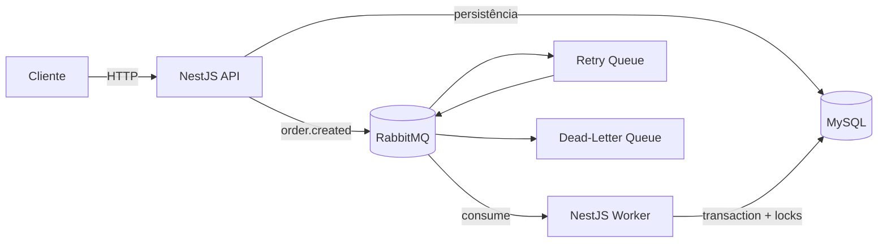

# Orders API

API backend para criação e processamento assíncrono de pedidos, desenvolvida com **NestJS**, **TypeORM**, **MySQL** e **RabbitMQ**.

O projeto foi construído com foco em processamento assíncrono, concorrência de estoque, idempotência, retry, dead-letter queue, autenticação JWT, testes automatizados e observabilidade.

---

## Sumário

- [Visão geral](#visão-geral)
- [Stack](#stack)
- [Arquitetura](#arquitetura)
- [Fluxo de um pedido](#fluxo-de-um-pedido)
- [Modelagem de dados](#modelagem-de-dados)
- [RabbitMQ](#rabbitmq)
- [Concorrência e reserva de estoque](#concorrência-e-reserva-de-estoque)
- [Idempotência](#idempotência)
- [Retry e Dead-Letter Queue](#retry-e-dead-letter-queue)
- [Autenticação e autorização](#autenticação-e-autorização)
- [Observabilidade](#observabilidade)
- [Como executar](#como-executar)
- [Endpoints](#endpoints)
- [Exemplos de requisição](#exemplos-de-requisição)
- [Testes](#testes)
- [Decisões](#decisões)
- [Respostas de arquitetura](#respostas-de-arquitetura)

---

## Visão geral

Ao receber um novo pedido, a API:

1. valida os dados de entrada;
2. calcula o valor total;
3. persiste o pedido com status `PENDING`;
4. publica o evento `order.created` no RabbitMQ;
5. devolve a resposta sem aguardar o processamento de estoque.

Um worker separado consome o evento e executa a reserva de estoque dentro de uma transação MySQL.

O resultado final do processamento pode ser:

- `PENDING`: pedido criado e aguardando processamento;
- `PROCESSED`: estoque reservado com sucesso;
- `FAILED`: falha definitiva, como estoque insuficiente ou erro após esgotar os retries.

---

## Stack

| Tecnologia | Uso |
|---|---|
| NestJS | Framework da API e do worker |
| TypeScript | Linguagem |
| TypeORM | ORM e controle transacional |
| MySQL 8.4 | Banco relacional |
| RabbitMQ 4 | Mensageria |
| Docker / Docker Compose | Ambiente local |
| JWT / Passport | Autenticação |
| Jest | Testes automatizados |
| Swagger / OpenAPI | Documentação da API |
| Pino | Logs estruturados |
| Decimal.js | Cálculos monetários |

---

## Arquitetura

A API HTTP e o worker são processos separados. Isso permite que o consumo da fila seja escalado independentemente da API.



### Componentes principais

```text
API
├── Auth
├── Orders Controller
├── Orders Service
├── TypeORM
└── RabbitMQ Publisher

Worker
├── RabbitMQ Consumer
├── Retry Policy
├── Order Processor
├── TypeORM
└── MySQL Transaction / Locks
```

---

## Fluxo de um pedido

### Criação

```text
POST /orders
     ↓
Validação do DTO
     ↓
Cálculo do total
     ↓
Order = PENDING
     ↓
Commit no MySQL
     ↓
Publicação order.created
     ↓
Resposta HTTP
```

A validação de estoque não ocorre no `POST /orders`. O pedido pode ser aceito pela API e posteriormente falhar durante o processamento assíncrono.

### Processamento

```text
order.created
     ↓
Worker
     ↓
Delay de processamento
     ↓
Transaction MySQL
     ↓
Lock do pedido
     ↓
Lock dos produtos
     ↓
Verificação do estoque
   /                  \
suficiente         insuficiente
   ↓                  ↓
reserva estoque      FAILED
   ↓
PROCESSED
   ↓
COMMIT
   ↓
ACK
```

---

## Modelagem de dados

### `products`

Responsável pelo estoque disponível.

```text
id
name
stock
created_at
updated_at
```

`name` possui restrição de unicidade.

### `orders`

```text
id
customer_name
total
status
failure_reason
processed_at
created_at
updated_at
```

`status` pode ser:

```text
PENDING
PROCESSED
FAILED
```

### `order_items`

```text
id
order_id
product_id
product_name
quantity
unit_price
subtotal
created_at
```

O nome e o preço do produto também são persistidos no item do pedido para manter um snapshot histórico do momento da compra.

### `users`

```text
id
username
password_hash
role
created_at
updated_at
```

Roles disponíveis:

```text
ADMIN
USER
```

### Relacionamentos

```text
Order 1 ───── N OrderItem N ───── 1 Product
```

Valores monetários são persistidos como `DECIMAL(12,2)` e calculados com `Decimal.js`.

---

## RabbitMQ

O projeto utiliza RabbitMQ para desacoplar a criação do pedido do processamento de estoque.

### Topologia

```text
orders.exchange
     │
     └── order.created
            ↓
     orders.created.queue
```

Em caso de erro técnico:

```text
orders.created.queue
        ↓
orders.retry.exchange
        ↓
orders.retry.queue
        ↓ TTL
orders.exchange
        ↓
orders.created.queue
```

Após o limite de retries:

```text
orders.created.queue
        ↓
orders.dlx
        ↓
orders.dlq
```

### Filas

- `orders.created.queue`
- `orders.retry.queue`
- `orders.dlq`

### Exchanges

- `orders.exchange`
- `orders.retry.exchange`
- `orders.dlx`

### ACK manual

O consumer utiliza confirmação manual.

Uma mensagem só recebe `ACK` depois que o processamento foi concluído com sucesso ou depois que uma nova mensagem de retry foi publicada e confirmada.

---

## Concorrência e reserva de estoque

Um dos principais pontos da implementação é evitar overselling.

Considere:

```text
Estoque disponível: 5

Pedido A: 4 unidades
Pedido B: 4 unidades
```

A solução adotada utiliza:

- transação MySQL;
- `pessimistic_write` pelo TypeORM;
- lock do pedido;
- lock dos produtos;
- validação do estoque antes de qualquer decremento.

Fluxo simplificado:

```text
Worker A                     Worker B
   │                            │
   ├── lock Product             │
   │                            ├── aguarda lock
   │
stock = 5
   │
5 >= 4
   │
stock = 1
   │
COMMIT
                                │
                           lock liberado
                                │
                           stock = 1
                                │
                           1 >= 4 ❌
                                │
                           FAILED
```

Resultado:

```text
Pedido A = PROCESSED
Pedido B = FAILED
Estoque final = 1
```

Itens repetidos do mesmo produto dentro do pedido também são agrupados antes da verificação do estoque.

---

## Idempotência

Antes de processar um pedido:

1. inicia uma transação;
2. bloqueia o pedido com `pessimistic_write`;
3. verifica seu status;
4. somente pedidos `PENDING` podem reservar estoque.

Exemplo:

```text
Primeira entrega
PENDING
  ↓
Reserva estoque
  ↓
PROCESSED
```

Caso a mesma mensagem seja entregue novamente:

```text
Segunda entrega
PROCESSED
  ↓
Ignora processamento
```

Dessa forma, um retry ou uma reentrega não decrementa o estoque duas vezes.

---

## Retry e Dead-Letter Queue

Para simular uma falha técnica, pedidos cujo `customerName` contém a palavra `fail` geram uma exceção durante o processamento.

A política configurada permite 3 retries.

```text
Tentativa inicial
    ↓
Retry 1
    ↓
Retry 2
    ↓
Retry 3
    ↓
FAILED
    ↓
DLQ
```

A retry queue utiliza TTL para criar um pequeno atraso antes da nova tentativa.

Cada retry incrementa o header `x-retry-count`.

Após o limite:

- o pedido é marcado como `FAILED`;
- o motivo é persistido em `failure_reason`;
- a mensagem é encaminhada para `orders.dlq`.

---

## Autenticação e autorização

Os endpoints de pedidos são protegidos por JWT.

### Usuário local de demonstração

```text
username: admin
password: admin123
role: ADMIN
```

A senha é armazenada como hash no banco.

### Login

```http
POST /auth/login
```

```json
{
  "username": "admin",
  "password": "admin123"
}
```

Resposta:

```json
{
  "accessToken": "..."
}
```

Nas demais requisições:

```text
Authorization: Bearer <token>
```

O endpoint de reprocessamento manual exige role `ADMIN`.

### SSO

A implementação atual utiliza JWT local.

---

## Observabilidade

Cada request recebe um `correlationId`.

Se o cliente enviar `x-correlation-id`, esse valor é preservado. Caso contrário, a aplicação gera um UUID.

O mesmo identificador é propagado para o evento `order.created` e utilizado nos logs do worker.

Isso permite seguir o mesmo pedido entre:

```text
API → RabbitMQ → Worker → MySQL
```

Os logs são estruturados com Pino.

---

## Como executar

### Pré-requisitos

- Docker
- Docker Compose

### Subir toda a aplicação

```bash
docker compose up --build -d
```

O Compose sobe:

- MySQL;
- RabbitMQ;
- migrations;
- API;
- worker.

### Conferir os containers

```bash
docker compose ps -a
```

Resultado esperado:

```text
mysql       Up (healthy)
rabbitmq    Up (healthy)
migration   Exited (0)
api         Up
worker      Up
```

O container `migration` finalizar com `Exited (0)` é esperado.

### Logs

Todos os serviços:

```bash
docker compose logs -f
```

Somente API:

```bash
docker compose logs -f api
```

Somente worker:

```bash
docker compose logs -f worker
```

### Parar

```bash
docker compose down
```

---

## URLs locais

### API

```text
http://localhost:3000
```

### Swagger

```text
http://localhost:3000/docs
```

### RabbitMQ Management

```text
http://localhost:15672
```

Credenciais:

```text
orders_user
orders_password
```

### MySQL

```text
Host: localhost
Port: 3306
Database: orders
User: orders_user
Password: orders_password
```

---

## Endpoints

| Método | Endpoint | Descrição | Auth |
|---|---|---|---|
| POST | `/auth/login` | Login | Não |
| POST | `/orders` | Cria pedido | JWT |
| GET | `/orders/:id` | Consulta pedido | JWT |
| GET | `/orders?page=1&limit=10` | Lista pedidos | JWT |
| POST | `/orders/:id/reprocess` | Reprocessa pedido `FAILED` | JWT / ADMIN |

---

## Exemplos de requisição

### Criar pedido

```http
POST /orders
Authorization: Bearer <token>
Content-Type: application/json
```

```json
{
  "customerName": "Victor",
  "items": [
    {
      "productName": "Mouse",
      "quantity": 2,
      "price": 150
    }
  ]
}
```

Resposta inicial:

```json
{
  "status": "PENDING"
}
```

Após o processamento:

```json
{
  "status": "PROCESSED"
}
```

### Estoque insuficiente

```json
{
  "customerName": "Victor",
  "items": [
    {
      "productName": "Keyboard",
      "quantity": 10,
      "price": 200
    }
  ]
}
```

Após processamento:

```json
{
  "status": "FAILED",
  "failureReason": "estoque insuficiente"
}
```

### Falha simulada

```json
{
  "customerName": "Victor fail",
  "items": [
    {
      "productName": "Monitor",
      "quantity": 1,
      "price": 800
    }
  ]
}
```

Após os retries:

```json
{
  "status": "FAILED",
  "failureReason": "Simulated processing failure"
}
```

---

## Testes

Executar testes:

```bash
npm test
```

Executar e2e:

```bash
npm run test:e2e
```

### Cenários esperados

#### Unitários

- cálculo do total do pedido;
- regra de retry/falha.

#### Integração / E2E

- criação de pedido com status inicial `PENDING`;
- estoque insuficiente;
- processamento com sucesso;
- concorrência de estoque;
- idempotência / processamento duplicado.

### Cenário de concorrência

Estoque inicial:

```text
Mouse = 5
```

Dois pedidos simultâneos:

```text
Pedido A = 4
Pedido B = 4
```

Resultado esperado:

```text
1 pedido PROCESSED
1 pedido FAILED
stock = 1
```

Nunca:

```text
stock < 0
```

---

## Decisões

### TypeORM + pessimistic locking

Foi escolhido `pessimistic_write` por ser uma solução clara para garantir consistência sob concorrência em MySQL.

### Worker separado

API e worker são processos independentes para permitir escalabilidade independente.

### RabbitMQ

Foi escolhido RabbitMQ por oferecer explicitamente:

- acknowledgement;
- competing consumers;
- dead-letter exchanges;
- retry queues;
- durable queues;
- persistent messages.


---

# Respostas de arquitetura

## 1. Como garantir que um evento não seja processado duas vezes pelo consumidor em caso de reentrega da fila?

Eu trataria o consumer como idempotente, porque uma mensagem do RabbitMQ pode ser entregue novamente.

No projeto, antes de processar o pedido eu verifico o status dele dentro de uma transação. Somente pedidos com status `PENDING` podem alterar o estoque.

Depois que o pedido é processado, ele passa para `PROCESSED` ou `FAILED`. Se a mesma mensagem chegar novamente, o worker identifica que o pedido já foi processado e não altera o estoque outra vez.

Também utilizo lock no pedido durante esse processo para evitar que dois workers processem o mesmo pedido ao mesmo tempo.

---

## 2. Como escalar o worker se o volume de pedidos aumentar 10x?

Como a API e o worker são processos separados, eu poderia subir mais instâncias do worker consumindo a mesma fila.

O RabbitMQ distribuiria as mensagens entre esses workers, permitindo processar mais pedidos ao mesmo tempo.

Também acompanharia o tamanho da fila e o tempo de processamento para entender quantos workers seriam necessários.

Além disso, seria importante monitorar o banco, porque aumentar muito a quantidade de workers também aumenta a quantidade de acessos e locks no MySQL.

---

## 3. Como fazer uma migração de schema em produção sem downtime?

Eu evitaria fazer uma mudança que quebrasse imediatamente a versão atual da aplicação.

Por exemplo, se precisasse adicionar uma nova coluna, primeiro adicionaria ela de forma opcional e faria o deploy da aplicação preparada para trabalhar com essa nova estrutura.

Depois de atualizar os dados existentes, poderia tornar essa coluna obrigatória ou remover estruturas antigas em uma migration posterior.

A ideia seria dividir mudanças grandes em pequenas etapas compatíveis entre si, evitando alterações que travem a tabela por muito tempo.

---

## 4. Se o provedor de SSO ficar indisponível, como isso afeta a API e como mitigar?

Se o provedor de SSO ficar indisponível, novos logins provavelmente seriam afetados.

Para usuários que já possuem um JWT válido, a API ainda poderia continuar funcionando caso a validação do token seja feita localmente utilizando a chave pública do provedor.

Para reduzir o impacto, eu manteria essa chave em cache e configuraria timeout nas chamadas feitas ao provedor.

Também monitoraria a disponibilidade do serviço de autenticação para identificar esse tipo de problema rapidamente.

---

## 5. Como investigar um pedido que ficou PENDING sem confirmação?

Eu começaria pelo `orderId` e verificaria no banco quando o pedido foi criado e qual é o status atual.

Depois buscaria os logs da API para confirmar se o pedido foi salvo e se o evento foi publicado no RabbitMQ.

No RabbitMQ, verificaria se existem mensagens paradas na fila, mensagens sem ACK, retries ou mensagens na DLQ.

Depois verificaria os logs do worker usando o mesmo `orderId` ou `correlationId`.

Assim eu conseguiria seguir o caminho do pedido e identificar se o problema aconteceu na API, no RabbitMQ, no worker ou no banco.
